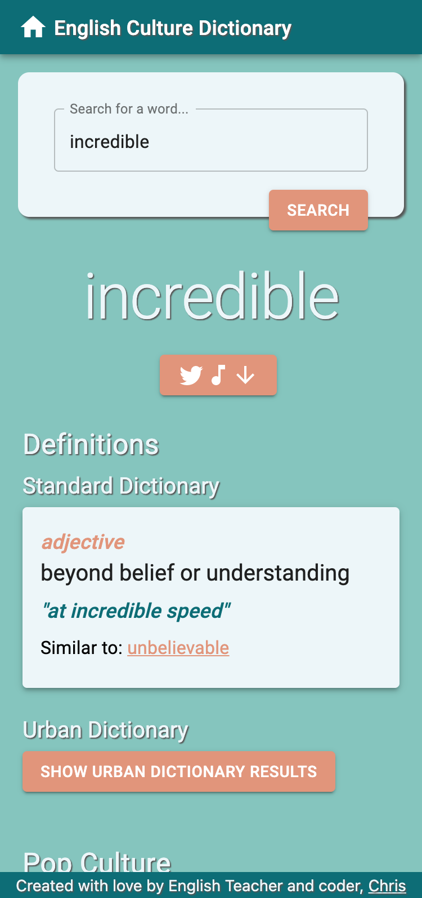
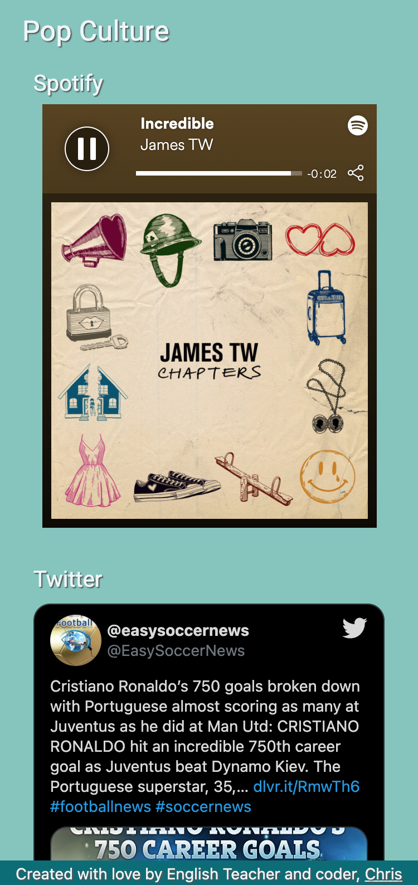

# The English Culture Dictionary

A _modern_ dictionary intended for English as a Second Language learners. 

In my time as a teacher, and as a language learner, I've noticed a gap between textbook/dictionary definitions and the ways in which words are _actually_ used by _actual_ people. If you look up "lit", you' probably find something like "_verb_ past and past participle of light." How many of the 17 million #lit Instagram posts were aiming for that definition?

### Features
* Return a standard dictionary definition to act as a foundation. A control variable, if you will.
* Urban dictionary results (hidden by default, to protect younger users) to show user-submitted definitions.
* A spotify widget containing a song with their search term in the title.
* Two tweets to show example sentences.
* Optimised for mobile, as most English e-learners use mobile for quick reference.

### Made Using
   

 

## ToDo List
- [ ] Limit to songs locally available to user
- [ ] Limit songs to exact matches
- [ ] Enable user to create playlist
- [ ] Switch mode for explicit/niche
